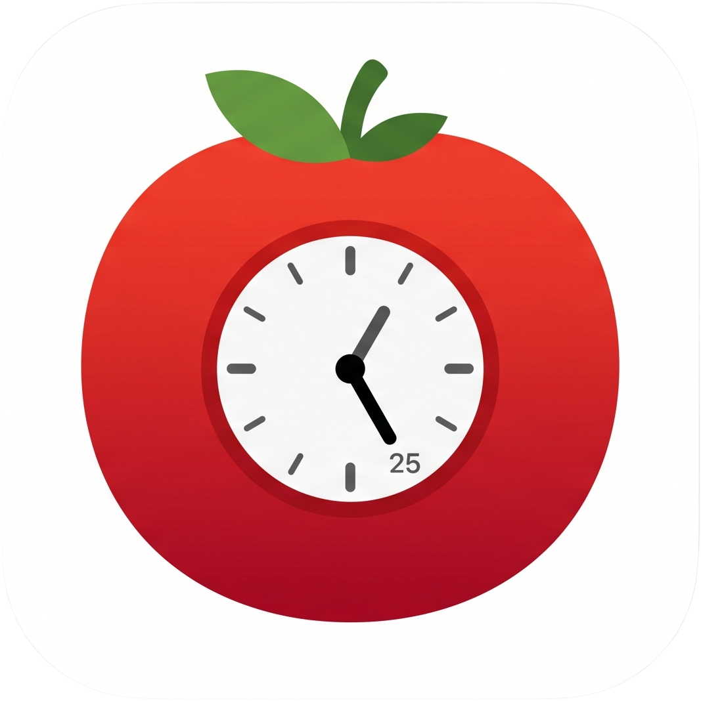
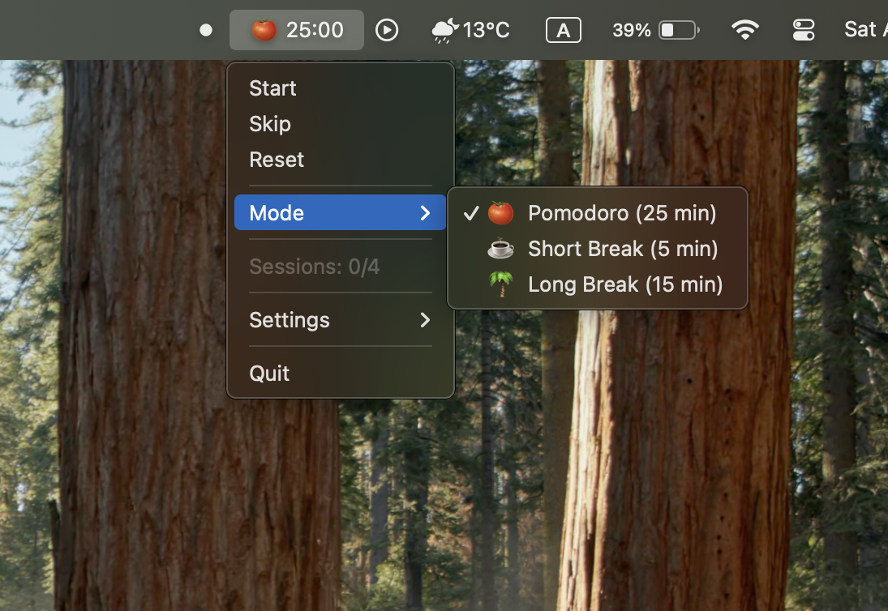

<div align="center">



# PomoBar

A lightweight macOS menu bar Pomodoro timer. Built with Python and [rumps](https://github.com/jaredks/rumps).



</div>


## Features

- **Menu bar countdown** — always-visible timer with mode icons (🍅 ☕ 🌴), icon toggleable
- **3 timer modes** — Pomodoro, Short Break, Long Break; durations shown in the mode menu and fully customizable
- **Auto-start** — optionally auto-start breaks and/or pomodoros
- **Long break interval** — configurable number of pomodoros before a long break (default: 4)
- **Alarm sounds** — enable/disable, choose from 14 macOS system sounds, adjust volume and repeat count
- **Ticking sound** — enable/disable background ticking with sound and volume selection
- **Session tracking** — displays completed pomodoros in the current cycle; resets with the Reset button
- **macOS notifications** — alerts when sessions complete
- **Persistent settings** — saved to `~/.pomobar.json`

## Install & Run

### Manual Installation

Download the "PomoBar.zip" file from the [latest release](https://github.com/jamesak535/pomobar/releases/latest) and move the unzipped app into your `Applications` folder.

### From source (recommended for development)

```bash
git clone https://github.com/jamesak535/pomobar.git
cd pomobar
python3 -m venv .venv
source .venv/bin/activate
pip install -r requirements.txt
python pomobar.py
```

### Build standalone .app

Requires Python 3.12 (3.13+ may have compatibility issues with py2app).

```bash
pip install py2app
brew install libffi
chmod +x build_app.sh
./build_app.sh
```

The built app will be at `dist/PomoBar.app`. You can drag it to your Applications folder.

## Settings

All settings are accessible from the menu bar dropdown under **Settings**:

| Setting | Default | Description |
|---|---|---|
| Pomodoro Duration | 25 min | Length of focus sessions |
| Short Break Duration | 5 min | Length of short breaks |
| Long Break Duration | 15 min | Length of long breaks |
| Long Break Interval | 4 | Pomodoros before a long break |
| Auto-start Breaks | Off | Auto-start break after pomodoro ends |
| Auto-start Pomodoros | Off | Auto-start pomodoro after break ends |
| Show Mode Icon | On | Show/hide the mode emoji (🍅 ☕ 🌴) in the menu bar |
| Alarm Enabled | On | Enable or disable the alarm sound |
| Alarm Sound | Ping | macOS system sound for alerts |
| Alarm Volume | 50 | 0–100 |
| Alarm Repeat | 1 | Times to repeat alarm |
| Ticking Enabled | Off | Enable or disable background ticking |
| Ticking Sound | Tink | macOS system sound for ticking |
| Ticking Volume | 20 | 0–100 |

## Requirements

- macOS 10.15+
- Python 3.12 (for building .app)

## License

[GPL-3.0](LICENSE)